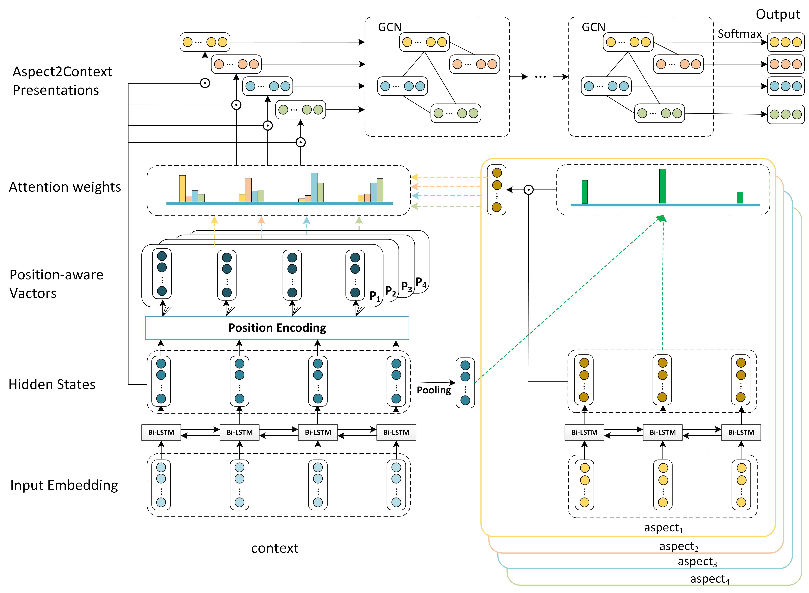

# SDGCN
 
> Tensorflow Implementations.
>
>
> 使用Tensorflow实现。

## Requirement
* python 3.6 / 3.7
* tensorflow >= 1.12
* numpy 
* sklearn 
* bert_embedding
  * See [Bert Embeddings](https://github.com/imgarylai/bert-embedding) for more detail.


## Usage
### Creat the embedding
* GloVe: Download pre-trained word vectors [here](https://github.com/stanfordnlp/GloVe#download-pre-trained-word-vectors). In this implement, we use glove.42B.300d.zip

* BERT: Refer to [creat_BERT_embedding.py](./data/creat_BERT_embedding.py) and [creat_BERT_embedding_2_targets.py](./data/creat_BERT_embedding_2_targets.py) to create BERT Embedding if need.

### Training

```sh
python run_glove.py 
```
Train model with GloVe Embedding. See [run_glove.py](./run_glove.py) for more training arguments.

```sh
python run_bert.py 
```
Train model with BERT Embedding. See [run_bert.py](./run_bert.py) for more training arguments. 
## Citation
The manuscript is avaliable in arXiv:

 "Modeling Sentiment Dependencies with Graph Convolutional Networks for Aspect-level Sentiment Classification". arXiv preprint arXiv:1906.04501 (2019) [[pdf]](https://arxiv.org/pdf/1906.04501.pdf)



